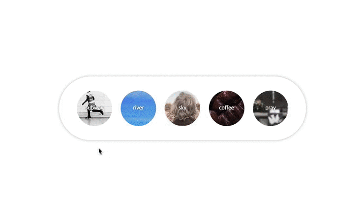

## 사전 수준 테스트
1. 3초마다 `<body>` 요소의 배경색을 바뀌도록 설정해보세요.
2. `<html>`, `<head>`, `<body>` 이 3개 요소를 각각의 변수 명에 할당(Assign)한 후,<br>
콘솔(Console)에 출력(Log)해보세요.

---

## 문서객체모델(DOM)과 자바스크립트(Javascript)

```js
/**
 * 문서 객체 모델 [DOM: Document Object Model]
 */
#document
	html          [ document.documentElement ]
		head      [ document.head ]
			meta
			title
		body      [ document.body ]
```

**변수 정의 및 할당, 콘솔에 기록**
```js
/**
 * 변수란? 변할 수 있는 수
 * x = -23
 * y = x + 90 // -23 + 90 = 67
 * 상수란? 항상 일관된 수
 * 90은 상수, x 또는 y는 변수
 *
 * 프로그래밍에서 변수란? 런타임 중에 변경이 가능한 메모리(공간)
 * 변수(Variables) -> var
 * 변수 정의 및 값 할당(대입)
 * var x = -23;
 * --------------------------------
 */
// 변수 정의
var html; // undefined
var head;
var body;

// 변수에 값 할당
html = document.documentElement;
head = document.head;
body = document.body;

// 콘솔에 기록
console.log(html, head, body);
```

## 변수 정의 패턴
```js
// 변수만 정의
var body, buttons;

// 선언된 변수에 값 할당
body    = document.body;
buttons = document.getElementsByTagName('button');

// 변수 선언과 동시에 값 할당
var body = document.body;
var buttons = document.getElementsByTagName('button');

// var 싱글턴 패턴
var body    = document.body,
	buttons = document.getElementsByTagName('button');
```

## 자바스크립트를 작성하는 곳
* `<head>` 내부 뒷 부분 (`<link rel="stylesheet" href="style.css">` 뒤)
* `<body>` 내부 어디든... (앞, 중간, 뒤)

```html
<!DOCTYPE html>
<html lang="ko-KR">
	<head>
		<meta http-equiv="X-UA-Compatible" content="IE=Edge">
		<meta charset="UTF-8">
		<title>자바스크립트를 작성하는 곳</title>
		<link rel="stylesheet" href="style.css">
		<script>// <head> 내부 입력</script>
	</head>
	<body>
		<script>// <body> 시작 위치 입력</script>

		<div id="page">

			<script>// <body> 중간 위치 입력</script>

			<main></main>

			<script>// <body> 중간 위치 입력</script>

		</div>

		<script>// <body> 끝 위치 입력</script>
	</body>
</html>
```


## 자바스크립트 엔진 해석

HTML 문서를 해석하는 엔진은 Javascript 코드를 만나면 Javasvript 해석기에게 일을 맡기고 쉰다.(일을 하지 않는다) 가능하다면 Javascript 코드는 UI가 완성되는데 시간을 지체하지 않도록 하는 것이 중요하다. 권장하는 스크립트 코드의 위치는 `</body>` 바로 앞이다.


## 자바스크립트 디자인 패턴 (설계 규칙)

1. **선택** `Selecting` ─ 제어할 대상을 찾는 것

	```js
		document.body // body element
	```

2. **조작** `Manipulation` ─ 선택한 대상을 조작하는 것

	```js
		var body = document.body;
		document.body.style.background = '#fcfae1';
		console.log(body.style.background); // #fcfae1
	```

3. **시점** `Event` ─ 대상에 언제 스타일을 설정할 것인가?

	```js
		// var body = document.body;
		document.body.onclick = function() {
			this.style.color: '#FE4940';
		};
	```

```js
/**
 * 요소를 선택한다.
 * 요소에 속성을 정의한다. (설정: SET)
 * 요소에 설정된 속성 값을 가져온다. (가져옴: GET)
 * --------------------------------
 */

var body = document.body;            // 요소노드 선택

body.style.color = 'red';            // SET
var getBodyColor = body.style.color; // GET
console.log(getBodyColor);           // 콘솔 화면에 출력(기록)

body.onclick = function() {			 // 이벤트 핸들링
	this.style.fontSize = '14px';
};


// 특정 시점(Event)에 따라 동작하게끔 수행하도록 만드는 것.
// 돔스크립트를 사용하는 디자인 패턴
body.onclick = function() {
	// function(){} 내부의 this 키워드는 onclick 이벤트가 연결된 대상을 가리킴
	console.log(this);

	// 서체 색상
	this.style['color'] = '#fc414b';
	// this.style.color = '#fc414b';

	// 서체 크기: font-size
	// this.style['font-size'] = '22px';
	this.style.fontSize = '22px';

	// 배경 색상: background-color
	this.style['background-color'] = '#320C10';
	// this.style.backgroundColor = '#320C10';

	// 최적화를 고려한 가장 권장되는 방법
	this.style.cssText = 'color: #fc414b; font-size: 22px; background-color: #320c10;';

};
```

## 문서 객체 모델 API

#### 접근(선택)
```js
// -------------------------------------------------------------
// ID 속성 값으로부터 대상(요소노드)을 참조하는 방법
// 단수 형태로 요소를 수집 : 요소노드(ElementNode)
// -------------------------------------------------------------
var page = document.getElementById('page');

var header, main, sidebar, footer;
header  = document.getElementById('header');
main    = document.getElementById('main');
sidebar = document.getElementById('sidebar');
footer  = document.getElementById('footer');

// -------------------------------------------------------------
// tagName, nodeName으로 대상 집합(노드리스트)을 참조하는 방법
// 복수 형태의 요소를 수집하는 것 : HTML Collection, NodeList
// 수집될 때는 마크업된 순서대로 수집된다.
// -------------------------------------------------------------
var div = document.getElementsByTagName('div'); // [div, div, div, div]

// 집합 내에서 원소(요소노드)를 꺼내야 이베튼 핸들링을 처리할 수 있다.
div[0].onclick = function() {
	this.style.color = '#34c0ff';
}
div[1].onclick = function() {
	this.style.color = '#2C9DA7';
}
```

#### W3C 표준 vs MS IE 비표준
```js
// W3C 표준 방식
var bgColor = window.getComputedStyle(this).backgroundColor;

// MS IE 비표준 방식
var bgColor = this.currentStyle.backgroundColor;
```

### 크로스 브라우징 헬퍼 함수
```js
// CSS 문서에 정의된 스타일 값을 가져오는 헬퍼함수
function getStyle(el, prop) {
	if ( window.getComputedStyle ) {
		return window.getComputedStyle(el)[prop];
	} else {
		return el.currentStyle[prop];
	}
};
```

## Javascript 조건문
```js
/**
 * 스크립트의 조건문
 * 조건이 참이면 실행
 * 조건이 거짓이면 실행 X

 * if ( 조건 ) {
 * 	조건이 참이면 실행되는 코드
 * } else {
 * 	조건이 거짓이면 실행되는 코드
 * }
 */

function getStyle(el, prop) {
	if ( window.getComputedStyle ) {
		return window.getComputedStyle(el)[prop];
	} else {
		return el.currentStyle[prop];
	}
};
```



## Javascript 반복문
```js
/**
 * --------------------------------
 * while, do ~ while 반복문
 * while (조건) {
 * 	조건이 참이면 코드 실행
 * }

	 * do {
	 * 	조건 유무와 상관없이 반드시 1회는 실행.
	 * 	조건이 참이면, 조건이 참인 동안 반복 실행.
 * } while (조건);
 * --------------------------------
 */


var buttons_len = buttons.length; // 4
var k = 0;

while( k < buttons_len ) {
	buttons[k++].onclick = function() {
		var background = getStyle(this, 'background');
		body.style.background = background;
		body.style.backgroundSize = 'cover';
	};
	// k = k + 1;
	// k += 1;
	// k++;
	// ++k;
}


/**
 * ---------------------------------------------
 * for 반복문
 * for (변수 선언 및 값 할당; 조건 확인; 변위 값 변화) {
 * 	반복 처리 구문
 * }
 * ---------------------------------------------
 */

for(var buttons_len = buttons.length, k = 0; k < buttons_len; k++ ) {
	buttons[k].onclick = function() {
		var background = getStyle(this, 'background');
		body.style.background = background;
		body.style.backgroundSize = 'cover';
	};
}
```